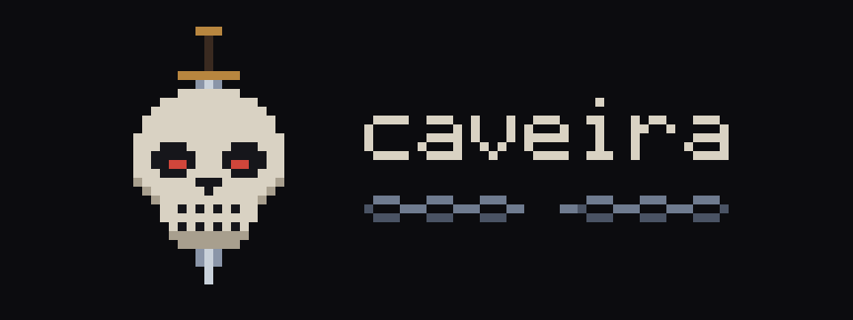

<div align="center">



# caveira

**A Claude Code–style coding agent for abliterated models.**<br>
*Your model, your machine, no refusals.*

</div>

---

caveira is an agentic coding assistant in the spirit of Claude Code, built to drive abliterated open-weight models, meaning models whose refusal behavior has been removed. It comes in two clients that share the same idea: you give the agent a task and it reads, edits, and runs code in your project.

## How it fits together

There is one backend, and it lives inside `web-client`: the Next.js app serves the website and the JSON API that both clients use. Accounts, sessions, and subscriptions are in SQLite through Drizzle, a local file in development and Turso in production.

The terminal client never takes a password. When you launch `caveira` for the first time it offers *Log in* or *Sign up*, shows a short code, and opens your browser. You sign in or create an account there and approve the code, and the CLI receives a session token that it keeps in `~/.caveira/auth.json`. If you have no subscription yet, the CLI shows the plans as cards; picking one opens Stripe Checkout in the browser.

Until Stripe keys are configured the backend runs in dev billing mode, where picking a plan activates it straight away with no card involved. The whole flow works on a fresh checkout with nothing configured.

## Layout

- `assets/caveira-icon.svg` is the desktop app icon: a softly rounded, pure-black skull eye socket on a subtle off-white (`#F8F8F5`) squircle. The 1024 × 1024 SVG uses an 824 × 824 tile with transparent desktop-icon margins.
- `web-client/` is the website and the shared backend: Next.js (App Router), TypeScript, Tailwind CSS, Drizzle, managed with bun. See [web-client/README.md](web-client/README.md).
- `tui/` is the terminal client: Go with Bubble Tea v2. See [tui/README.md](tui/README.md).

The coding agent itself is not built yet. Signing in and choosing a plan lead to a placeholder screen.

## Quick start

```sh
make                          # web deps, database, both builds, `caveira` on PATH
cd web-client && bun run dev  # the backend, at http://localhost:3000
caveira                       # in another terminal
```

`make` installs `caveira` into `~/.local/bin`, pointed at `http://localhost:3000`. For a build aimed at a real deployment, run `make API_URL=https://your.deployment`. `make update` replaces an installed binary with a fresh build.

Configuration (Turso, Stripe, the public URL) is described in [web-client/.env.example](web-client/.env.example). None of it is needed to try the app locally.
